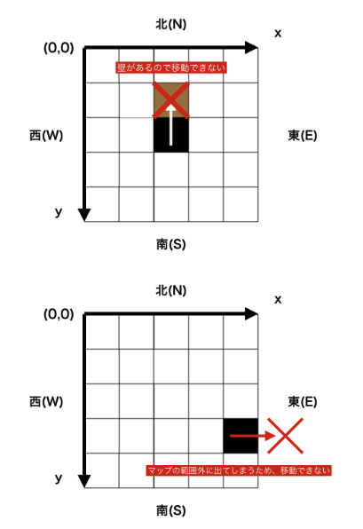

# へび

## Step1 移動が可能かの判定・方角

マップの行数 H と列数 W , 障害物を '#' で、移動可能な場所を '.' で表した H 行 W 列のマップ S_1 ... S_H が与えられます。
続けて現在の座標 sy , sx ,１マス移動する方角 m が与えられるので、移動が可能かどうかを判定してください。

移動が可能であるということは、以下の図の通り
「移動先が障害物でない　かつ　移動先がマップの範囲外でない」
ということを意味します。

なお、マスの座標系は左上端のマスの座標を ( y , x ) = ( 0 , 0 ) とし、
下方向が y 座標の正の向き、右方向が x 座標の正の向きとします。




### 方針

移動が可能かどうかの各条件は次のような処理に言い換えられます。
「移動先が障害物でない」
→ map[移動後のy座標][移動後のx座標]!='#'
「移動先がマップの範囲外でない」
→ 0<=移動後のy座標 && 移動後のy座標 < H && 0<=移動後のx座標 && 移動後のx座標 < W
これらを全て満たした場合、座標を出力するコードを書きます。

方角に基づいて移動し、移動後の座標について方針にある通り移動可能かの判定を if 文で行っています。


```Go
func HebiStep1() {
	var h, w, sy, sx, m string
	fmt.Scan(&h, &w, &sy, &sx, &m)

	s := make([][]rune, 0)
	for i := 0; i < len(h); i++ {
		var line string
		fmt.Scan(&line)
		s = append(s, []rune(line))
	}

	syInt, _ := strconv.Atoi(sy)
	sxInt, _ := strconv.Atoi(sx)

	switch m {
	case "N":
		syInt -= 1
	case "E":
		sxInt += 1
	case "S":
		syInt += 1
	case "W":
		sxInt -= 1
	}

	if sxInt < 0 || sxInt >= len(w) || syInt < 0 || syInt >= len(h) || s[syInt][sxInt] == '#' {
		fmt.Println("No")
	} else {
		fmt.Println("Yes")
	}
}

```

## Step2 移動が可能かの判定・方向

マップの行数 H と列数 W , 障害物を '#' , 移動可能な場所を '.' で表した H 行 W 列のマップ S_1 ... S_H が与えられます。
続けて現在の座標 sy , sx , 現在向いている方角 d , １マス移動する方向 m が与えられるので、移動が可能かどうかを判定してください。

移動が可能であるということは、以下の図の通り
「移動先が障害物でない　かつ　移動先がマップの範囲外でない」
ということを意味します。

なお、マスの座標系は左上端のマスの座標を ( y , x ) = ( 0 , 0 ) とし、
下方向が y 座標の正の向き、右方向が x 座標の正の向きとします。


### 方針

移動が可能かどうかの各条件は次のような処理に言い換えられます。
「移動先が障害物でない」→ map[移動後のy座標][移動後のx座標]!='#'
「移動先がマップの範囲外でない」 → 
0 <= 移動後のy座標 && 移動後のy座標 < H && 0 <= 移動後のx座標 && 移動後のx座標 < W
これらを全て満たした場合、座標を出力するコードを書きます。

```Go
package main

import (
	"fmt"
)

var sx, sy int

func move(D, M byte) {
	LR := 1

	if M == 'L' {
		LR = -1
	}

	switch D {
	case 'N':
		sx += LR
	case 'S':
		sx -= LR
	case 'E':
		sy += LR
	default:
		sy -= LR
	}
}

func main() {
	var H, W int
	var d, m byte
	fmt.Scan(&H, &W, &sy, &sx, &d, &m)

	S := make([]string, H)
	for i := 0; i < H; i++ {
		fmt.Scan(&S[i])
	}

	move(d, m)

	if 0 <= sx && sx < W && 0 <= sy && sy < H && S[sy][sx] != '#' {
		fmt.Println("Yes")
	} else {
		fmt.Println("No")
	}
}

```

## Step3 移動が可能かの判定・複数回の移動

マップの行数 H と列数 W , 現在の座標 sy , sx , 移動の回数 N が与えられます。
続けて、障害物を '#' で、移動可能な場所を '.' で表した H 行 W 列 のマップ S_1 ... S_H と N 回の移動の向き d_1 ... d_N が与えられます。

移動者ははじめ北を向いています。移動者は、1 回の移動で次の行動を行います。

「移動の向きに方向転換したのち、1 マス進む。」

各移動が可能である場合、移動後の y , x 座標を出力してください。
移動が可能でない場合、移動後の座標を出力する代わりに "Stop" を出力して、以降の移動を打ち切ってください。

各移動が可能であるということは、以下の図の通り
「移動先が障害物でない　かつ　移動先がマップの範囲外でない」
ということを意味します。

なお、マスの座標系は左上端のマスの座標を ( y , x ) = ( 0 , 0 ) とし、
下方向が y 座標の正の向き、右方向が x 座標の正の向きとします。

### 方針

```Go
```

## Step4 移動が可能かの判定・幅のある移動

マップの行数 H と列数 W , 障害物を '#' で移動可能な場所を '.' で表した H 行 W 列のマップ S_1 ... S_H , 現在の座標 sy, sx, 移動の回数 N が与えられます。
続けて、 N 回の移動の向き d_1 ... d_N と移動するマス数 l_1 ... l_N が与えられます。

プレイヤーははじめ北を向いています。

各移動が可能である場合、移動後の y , x 座標 を出力してください。
移動が可能でない場合(移動しきれない場合)、移動できるところまで移動した後の座標を出力した後に "Stop" を出力して、以降の移動を打ち切ってください。

各移動が可能であるということは、以下の図の通り
「今いるマスから移動先のマスまでに障害物がない　かつ　移動先がマップの範囲外でない」
ということを意味します。

なお、マスの座標系は左上端のマスの座標を ( y , x ) = ( 0 , 0 ) とし、
下方向が y 座標の正の向き、右方向が x 座標の正の向きとします。


### 方針

```Go
```

## Step5 幅のある移動

マップの行数 H と列数 W , 障害物を '#' で移動可能な場所を '.' で表した H 行 W 列のマップ S_1 ... S_H , 現在の座標 sy , sx , 移動の回数 N が与えられます。
続けて N 回の移動の向き d_1 ... d_N と移動するマス数 l_1...l_N が与えられます。

はじめは北を向いています。

各移動が可能である場合、スタート位置を含む移動の際に通ったマップのマスを '*' に変更してください。
移動が可能でない場合、障害物やマップの端までできる限り移動をして通ったマップのマスを '*' に変更したのち、以降の移動を打ち切ってください。

移動が終了した時のマップを出力してください。

移動可能であるということは、以下の図の通り
「今いるマスから移動先のマスまでに障害物がない かつ 移動先がマップの範囲外でない」
ということを意味します。

なお、マスの座標系は左上端のマスの座標を ( y , x ) = ( 0 , 0 ) とし、
下方向が y 座標の正の向き、右方向が x 座標の正の向きとします。

### 方針

```Go
```

## Step6 時刻に伴う移動

へびがマップ上を移動していきます。
マップの行数 H と列数 W , 障害物を '#' で移動可能な場所を '.' で表した H 行 W 列のマップ S_1 ... S_H , 現在の座標 sy , sx , 方向転換の回数 N が与えられます。
続けて N 回の方向転換する時刻 t_1 ... t_N , 転換する向き d_1 ... d_N が与えられます。

へびははじめ、北を向いています。

時刻 0 から 99 までの間、へびは各時刻に次の行動を最大 100 回とります。

・ 方向転換をおこなう時刻の場合、指定の向きに方向転換したのち 1 マス身体を伸ばす。
・ そうでない時は移動が可能な場合に限り、今向いている方向に 1 マス身体を伸ばす。

各移動が可能であるということは、
「移動先のマスに障害物がない かつ 移動先がマップの範囲外でない」
ということを意味します。

各移動が可能である場合、各移動が終了した時の y , x 座標を出力してください。
移動が可能でない場合、"Stop" を出力して以降の移動を打ち切ってください。

なお、マスの座標系は左上端のマスの座標を ( y , x ) = ( 0 , 0 ) とし、
下方向が y 座標の正の向き、右方向が x 座標の正の向きとします。

移動の一例をあげます。例えば次のような入力が与えられた時は図のような移動になります。

### 方針

```Go
```

## Step7 へび

マップ上をへびが移動していきます。
マップの行数 H と列数 W ,障害物を '#' で移動可能な場所を '.' で表した H 行 W 列のマップ S_1 ... S_H , 現在の座標 sy , sx , 方向転換の回数 N が与えられます。
続けて N 回の方向転換をおこなう時刻 t_1 ... t_N, 転換する向き d_1 ... d_N が与えられます。

へびははじめは北を向いています。

へびは進む先のマスに自分の身体や障害物がない時に移動ができます。
時刻 0 から 99 までの間、へびは各時刻に次の行動を最大 100 回繰り返します。

・ 方向転換をおこなう時刻の場合、指定の向きに方向転換したのち １ マス身体を伸ばす。そうでない時は、今向いている方向に １ マス身体を伸ばす。

時刻が 99 の時の行動を終えるか、移動できなくなった時、移動を終了します。
移動終了時にへびの体のあるマスを '*' にしたマップを出力してください。

移動が可能であるということは、
「移動先のマスに自分の身体や障害物がない かつ 移動先がマップの範囲外でない」
ということを意味します。

なお、マスの座標系は左上端のマスの座標を ( y , x ) = ( 0 , 0 ) とし、
下方向が y 座標の正の向き、右方向が x 座標の正の向きとします。

移動の一例をあげます。例えば次のような入力が与えられた時は図のような移動になります。
図は、時刻 T の行動前の状態を表しています。


### 方針

```Go
```