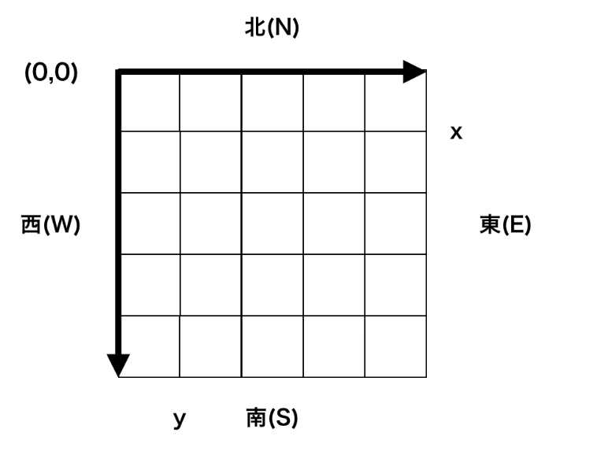
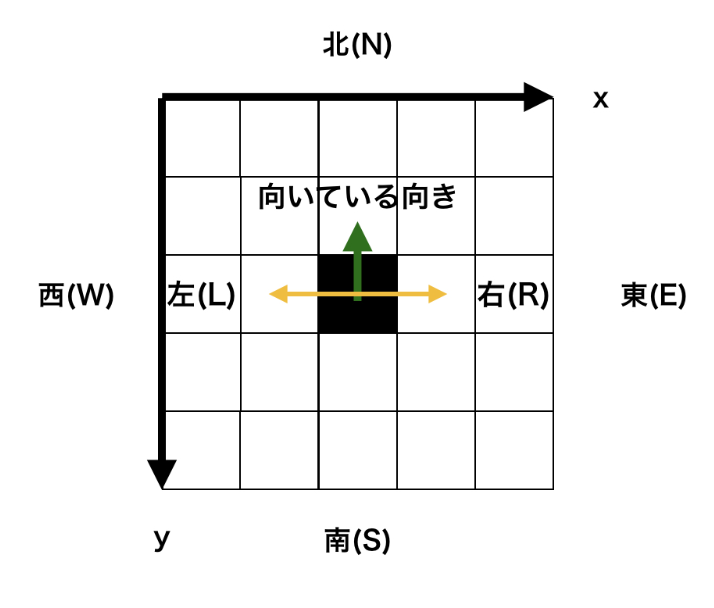
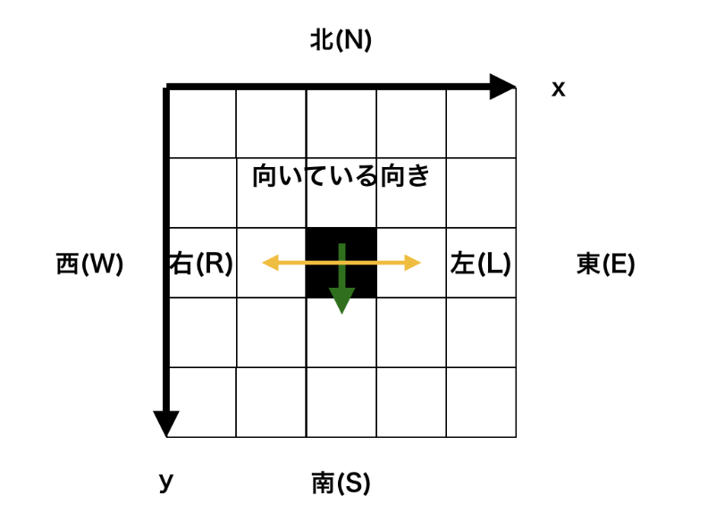
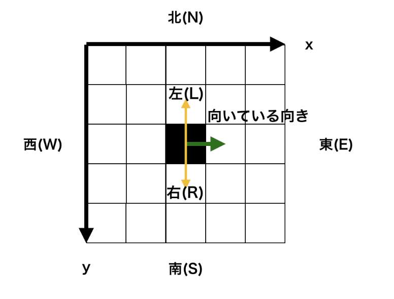
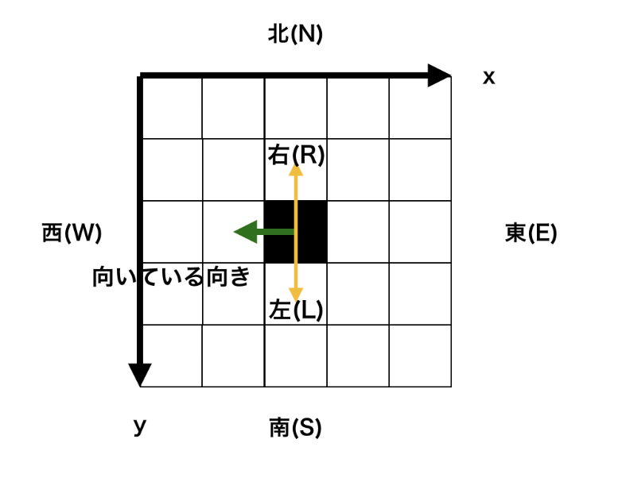

# 座標系での向きの変わる移動

## Step1 マップからの座標取得

マップの行数 H と列数 W とマップを表す H 行 W 列の文字列 S_1 ...S_H が与えられます。
要素が '#' になっているマスが 1 つあるので、その y , x 座標 を答えてください。

なお、マスの座標系は左上端のマスの座標を ( y , x ) = ( 0 , 0 ) とし、
下方向が y 座標の正の向き、右方向が x 座標の正の向きとします。


### 方針

各行各列の要素について for 文などを用いて全て調べます。
map_name[i][j] == '#' のときに i と j を出力すれば良いです。
二重ループを用いてすべてのマスを判定しています。
もし S[y][x] が # ならば座標を出力します。

```Go
func ZahyoStep1() {
	var H, W int
	fmt.Scan(&H, &W)

	S := make([][]rune, H)
	for y := 0; y < H; y++ {
		S[y] = make([]rune, W)
		var line string
		fmt.Scan(&line)
		for x, char := range line {
			S[y][x] = char
		}
	}

	for y := 0; y < H; y++ {
		for x := 0; x < W; x++ {
			if S[y][x] == '#' {
				fmt.Println(y, x)
			}
		}
	}
}

```

## Step2 座標系での移動・方角

開始時点の y , x 座標 と移動の回数 N が与えられます。
続く N 行で移動の方角 d_1 ... d_N が与えられるので、与えられた順に移動をしたときの各移動後の y , x 座標 を答えてください。

ただし、図の通り、上側（ y 軸の負の向き）を北とします。

なお、マスの座標系は左上端のマスの座標を ( y , x ) = ( 0 , 0 ) とし、
下方向が y 座標の正の向き、右方向が x 座標の正の向きとします。




### 方針

各方角への移動は次の通り言い換えができます。（座標軸の向きに注意）
北(N)への移動 → y座標を -1
南(S)への移動 → y座標を +1
東(E)への移動 → x座標を +1
西(W)への移動 → x座標を -1
この操作を現在の座標について行えば、各移動後の座標が分かります。

```Go
func ZahyoStep2() {
	var y, x, n int
	fmt.Scan(&y, &x, &n)

	for i := 0; i < n; i++ {
		var direction string
		fmt.Scan(&direction)

		switch direction {
		case "N":
			y -= 1
		case "E":
			x += 1
		case "S":
			y += 1
		case "W":
			x -= 1
		}

		fmt.Println(y, x)
	}
}

```

## Step3 座標系での移動・向き

開始時点の y , x 座標 と向いている方角 D が与えられます。
続く 1 行で移動の向き d が与えられるので、その向きに移動した後の y , x 座標 を答えてください。
移動前に向いている方角によって同じ移動の向きでも座標の変化が違うことに気をつけてください。

なお、マスの座標系は左上端のマスの座標を ( y , x ) = ( 0 , 0 ) とし、
下方向が y 座標の正の向き、右方向が x 座標の正の向きとします。
以下の図を参考にしてみてください。







### 方針

向いている方角と移動方向の組によって移動した結果の座標の変化が決まります。
北(N)を向いているとき
	左(L)に移動 → x座標を -1
	右(R)に移動 → x座標を +1
南(S)を向いているとき
	左(L)に移動 → x座標を +1
	右(R)に移動 → x座標を -1
東(E)を向いているとき
	左(L)に移動 → y座標を -1
	右(R)に移動 → y座標を +1
西(W)を向いているとき
	左(L)に移動 → y座標を +1
	右(R)に移動 → y座標を -1
これらを素直に実装します。

あらかじめ、右に移動するときの座標の変化を考えておけば、左に移動するときは、-1*(右に移動するときの座標の変化) であることを用いて実装しています。
移動方向がLだった場合には lr に -1 を、そうでない場合(R)は lr に1を入れることで移動量を決定しています。

```Go
func ZahyoStep3() {
	var y, x int
	var nowDirection string
	fmt.Scan(&y, &x, &nowDirection)

	var d string
	fmt.Scan(&d)

	lr := 1
	if d == "L" {
		lr = -1
	}

	if nowDirection == "N" {
		x += lr
	} else if nowDirection == "E" {
		y += lr
	} else if nowDirection == "S" {
		x -= lr
	} else if nowDirection == "W" {
		y -= lr
	}

	fmt.Println(y, x)
}
```
## Step4 座標系での規則的な移動

### 方針

```Go
```
