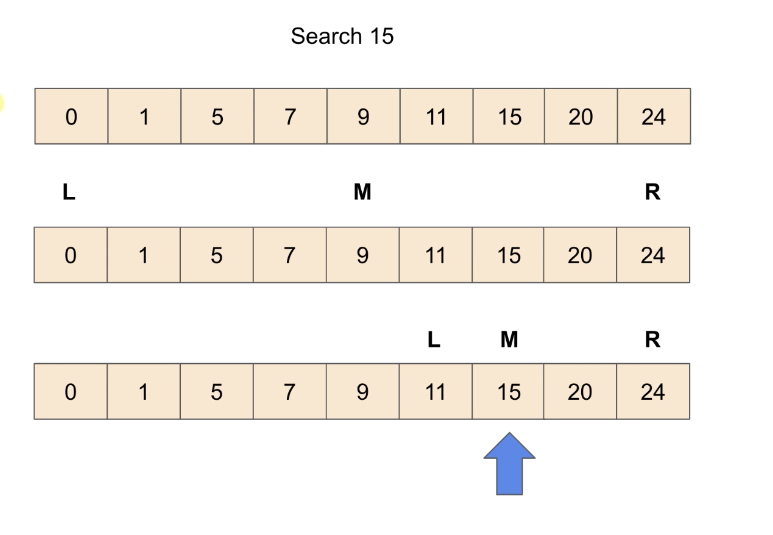

# Binary Search

## 値を探す

図の中で、左から順番に昇順で並べられた配列がある。
この配列を左から順番に探したい値を見つける方法がリニアサーチと呼ぶ。
この図で探したい数値を「15」とした場合の探し方をバイナリーサーチで探すと次のような探し方になる。

## バイナリーサーチの探し方

15という数字を探したい。
図の中にLMRという記号がある。
Lが一番小さく、Rが一番大きい
MはLとMを足して2で割った中間の数字となる。
中間の数値をみると「９」という値になる。
「９」の１個右の値をみると、「１１」になる。
「１１」は「１５」よりも小さいので、
Lを更新してもう一度隣を探す。
すると、「１５」が見つかった。

このような探し方をバイナリーサーチと呼ぶ。

